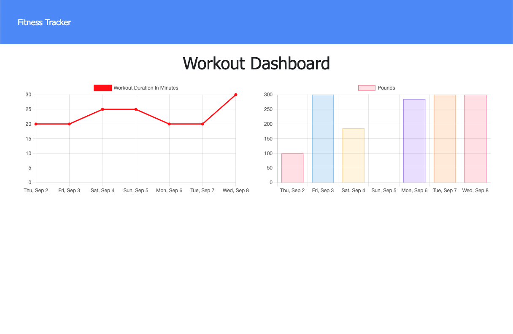
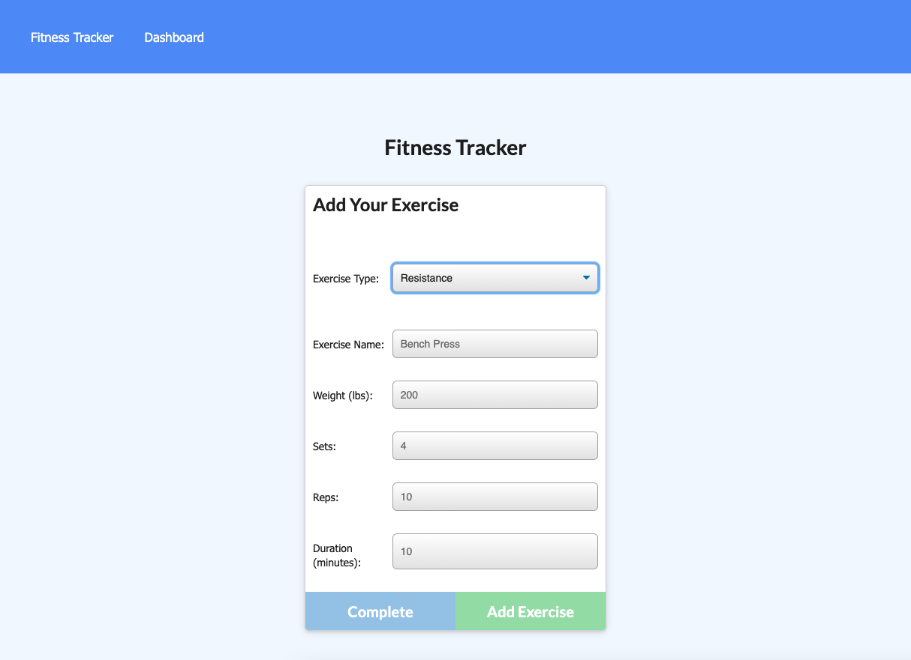
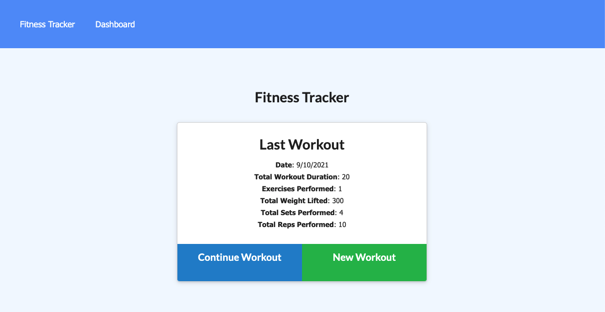

# Fitness Tracker

## Description

- User can track their workouts over the past seven workouts
- User can create their own workout adding exercises whether cardi oro resistance training.
- User will be able to modify most recent workout workout once it is complete or begin a new one.

## Table of Contents

- [Installation](#installation)
- [Usage](#usage)
- [Credits](#credits)
- [License](#license)

## Installation

**If forking/cloning repo, open console:**

If package.json file is present then type the command: `npm install`

_If no package.json file is present, type the command:_ `npm init -y` _then:_ `npm install dotenv mongoose morgan express`

## Usage

**Access application through heroku badge at top of REAME.md**

**Workout Dashboard**

**How to create an exercise**

**Workout stats**

## Credits

https://gist.github.com/lukas-h/2a5d00690736b4c3a7ba

https://coding-boot-camp.github.io/full-stack/github/professional-readme-guide

https://www.npmjs.com/

https://docs.mongodb.com/

https://mongoosejs.com/docs/guide.html

https://www.mongodb.com/cloud/atlas/

## License

MIT License

Copyright (c) 2021 Mark Lindskog

Permission is hereby granted, free of charge, to any person obtaining a copy
of this software and associated documentation files (the "Software"), to deal
in the Software without restriction, including without limitation the rights
to use, copy, modify, merge, publish, distribute, sublicense, and/or sell
copies of the Software, and to permit persons to whom the Software is
furnished to do so, subject to the following conditions:

The above copyright notice and this permission notice shall be included in all
copies or substantial portions of the Software.

THE SOFTWARE IS PROVIDED "AS IS", WITHOUT WARRANTY OF ANY KIND, EXPRESS OR
IMPLIED, INCLUDING BUT NOT LIMITED TO THE WARRANTIES OF MERCHANTABILITY,
FITNESS FOR A PARTICULAR PURPOSE AND NONINFRINGEMENT. IN NO EVENT SHALL THE
AUTHORS OR COPYRIGHT HOLDERS BE LIABLE FOR ANY CLAIM, DAMAGES OR OTHER
LIABILITY, WHETHER IN AN ACTION OF CONTRACT, TORT OR OTHERWISE, ARISING FROM,
OUT OF OR IN CONNECTION WITH THE SOFTWARE OR THE USE OR OTHER DEALINGS IN THE
SOFTWARE.
